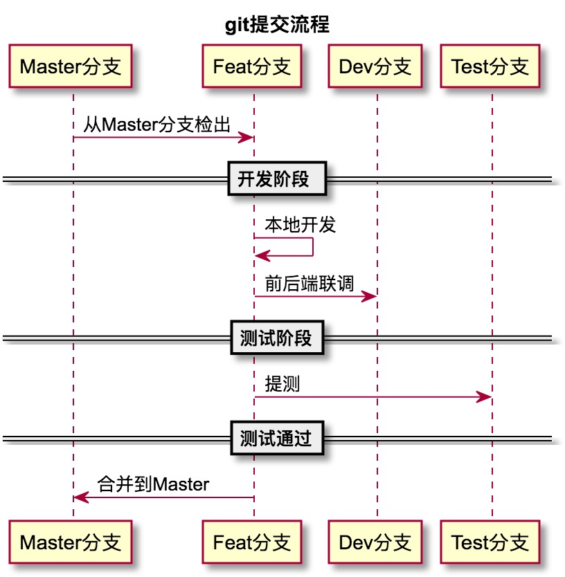

## git 提交流程


### git使用注意事项
> 不要将Master、Dev、Test等其他任何分支合并到自己的开发分支

## git 分支命名规则
```
分支版本命名规则：分支类型 分支发布时间 分支功能。比如：feature_20170401_fairy_flower
分支类型包括：feature、 bugfix、refactor三种类型，即新功能开发、bug修复和代码重构
时间使用年月日进行命名，不足2位补0
分支功能命名使用snake case命名法，即下划线命名。

```
## 使用git commit模板提交你的代码

## 全局安装插件

> sudo npm install -g commitizen

## 使用

> git cz 或者 npm run commit 按步骤输入 <br>
注：本工程已使用钩子控制，养成良好的编码习惯从git提交开始


```
@startuml

title git提交流程

Master分支 -> Feat分支 :从Master分支检出

== 开发阶段 ==

Feat分支 -> Feat分支:本地开发

Feat分支 -> Dev分支:前后端联调

==测试阶段==

Feat分支 -> Test分支 :提测

==测试通过==

Feat分支 -> Master分支: 合并到Master

@enduml
```

## git commit
commit message 应该清晰明了，说明本次提交的目的。
格式如下
```
<type>:主模块/项目名:<subject>

例如：Feat:Task-Calendar2.0:任务日历日试图基本组件开发
```
#### type

```
feat：新功能（feature）
fix：修补bug
docs：文档（documentation）
style： 格式（不影响代码运行的变动）
refactor：重构（即不是新增功能，也不是修改bug的代码变动）
test：增加测试
chore：构建过程或辅助工具的变动

```
#### subject
```
subject是 commit 目的的简短描述，不超过50个字符。

功能开发以模块名称开头，Fix 以 TapdID开头

```